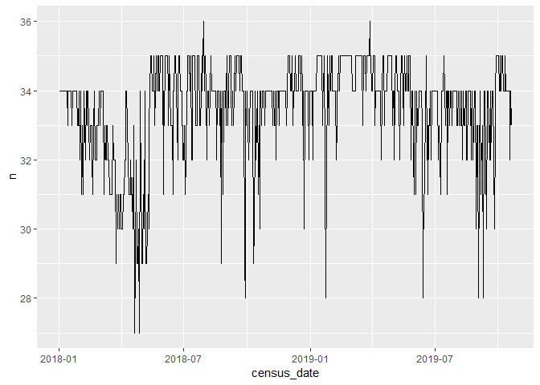
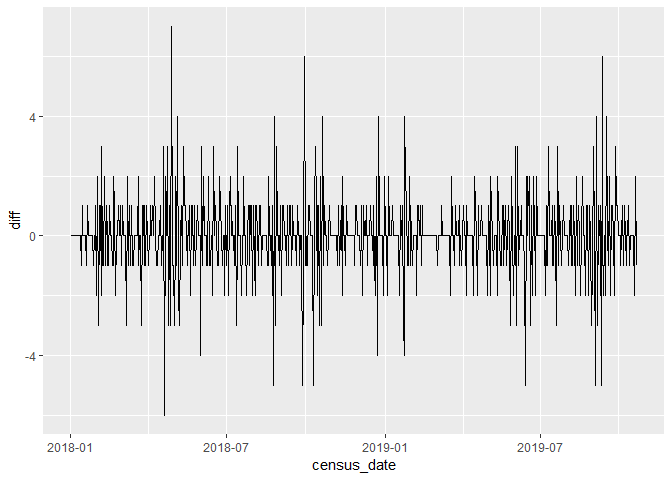
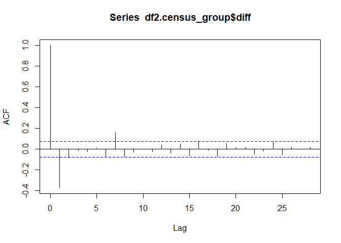
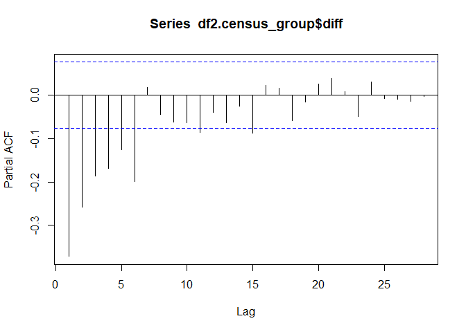

--- 
title: "LGH Census explorations"
author: "Nayef Ahmad"
date: "2019-10-22"
output: 
  html_document: 
    keep_md: yes
    code_folding: show
    toc: true
    toc_float: true
---


```r
df1.census <- vw_census %>% 
  filter(facility_short_name == "LGH", 
         nursing_unit_desc_at_census == "LGH 4 East", 
         census_date_id >= "20180101", 
         census_date_id < "20191021") %>% 
  select(patient_id, 
         census_date_id) %>% 
  collect


df2.census_group <- 
  df1.census %>% 
  count(census_date_id) %>% 
  mutate(census_date = ymd(census_date_id), 
         diff = n - lag(n)) %>% 
  drop_na()


df2.census_group %>% 
  ggplot(aes(x = census_date, 
             y = n)) + 
  geom_line()
```

<!-- -->

```r
df2.census_group %>% 
  ggplot(aes(x = census_date, 
             y = diff)) + 
  geom_line()
```

<!-- -->

```r
acf(df2.census_group$diff)
```

<!-- -->

```r
pacf(df2.census_group$diff)
```

<!-- -->

Interpreting the ACF & PACF: 

Looks like this should be a MA model?? [citation needed]

From Shumway and Stoffer, p108: 


---
title: "2019-10-22_lgh_census-explorations.R"
author: "nahmad3"
date: "2019-10-22"
---
